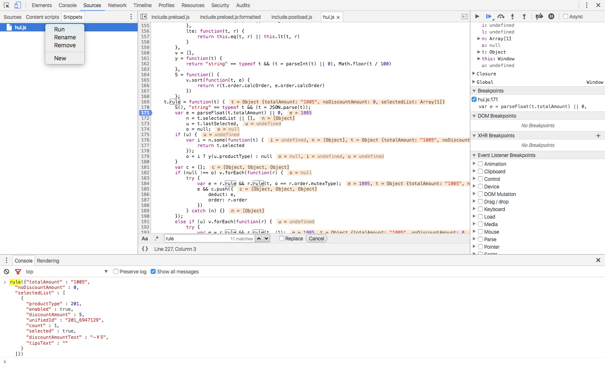

如何在chrome中调试JS代码呢，如果本身网页中就有js代码文件，那么打开chrome，mac上快捷键option+command+i，然后进入开发者模式，选择Sources，content Scripts，进行正常的调试即可，这里不做过多的介绍，需要的可以到[参考官方文档](https://developer.chrome.com/devtools/docs/javascript-debugging)

自己在这里主要介绍的是如何调试自己写的JS脚本，本身还没有嵌入到网页中的，这里就需要用到另外一个`Snippets`，这个就是自己在这里写JS脚本，然后run之后，就可以在console中进行调试，跟加载在网页中的一样。

1. 右键Snippets区域  选择new，然后创建一个js文件，这里取名hui.js
2. 编辑hui.js，并保存。
3. 右键hui.js文件，然后选择run
4. 设置断点
5. console中执行js中的功能，记性断点调试即可。

> ###参考链接
> ####https://developers.google.com/web/tools/chrome-devtools/debug/snippets/